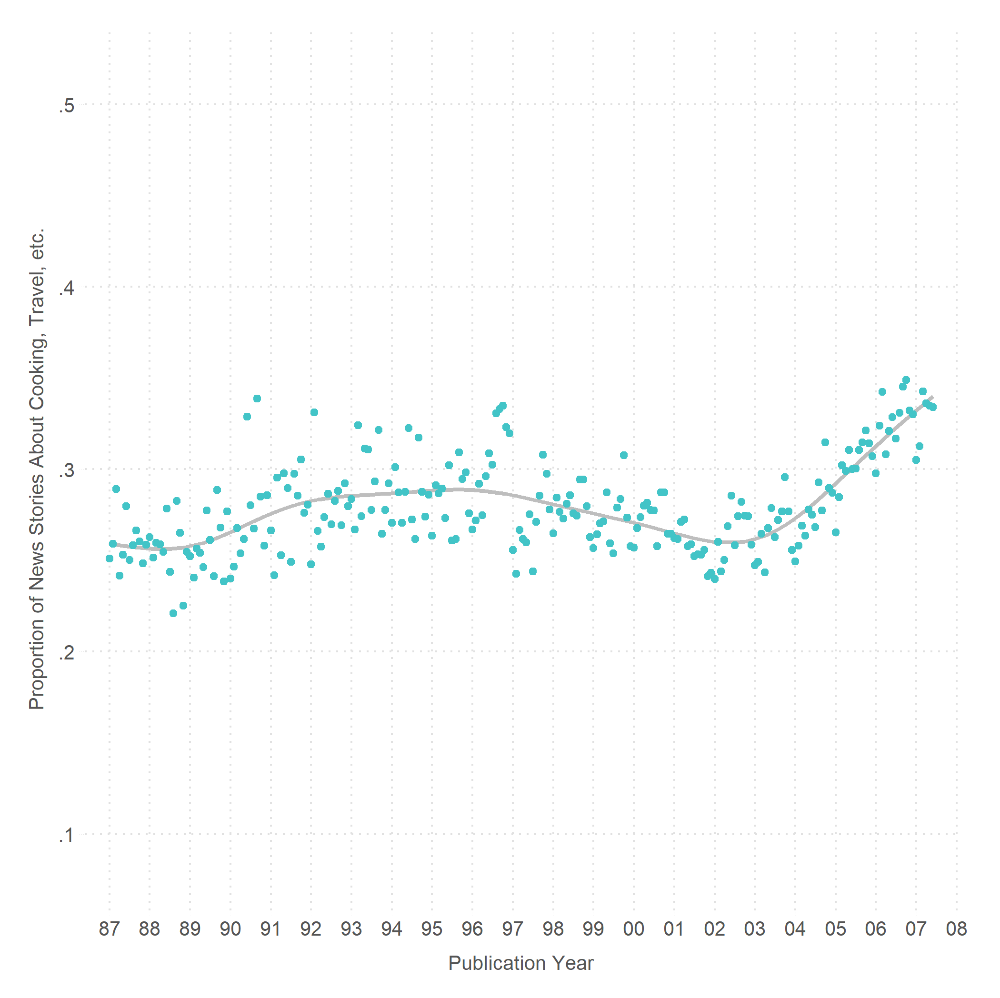
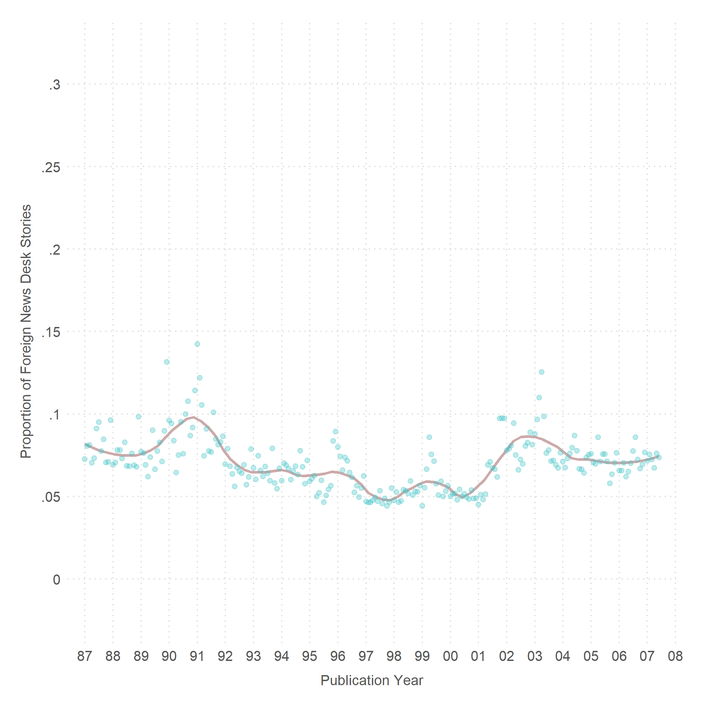
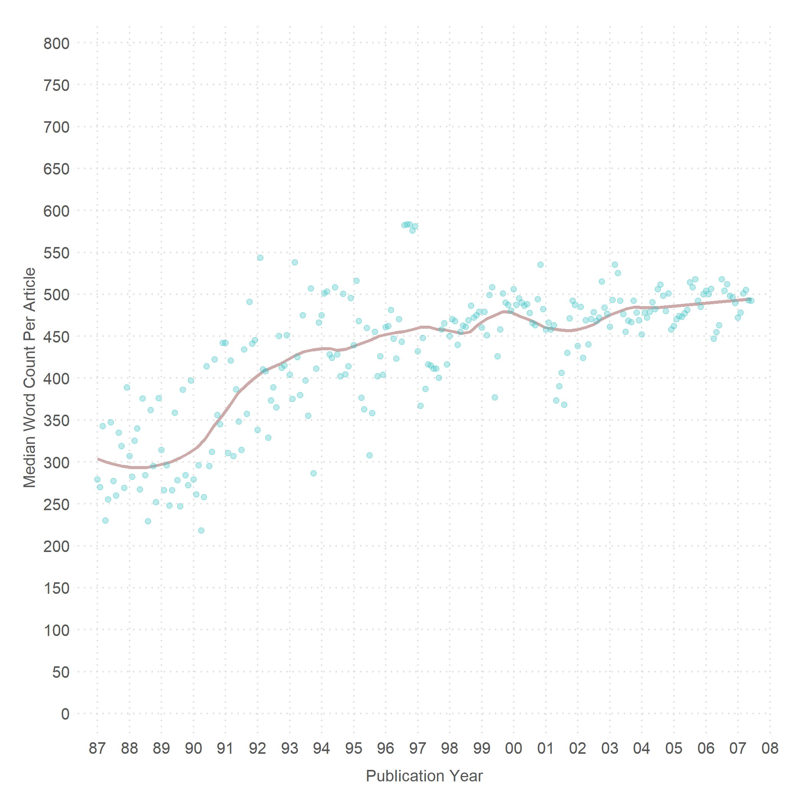
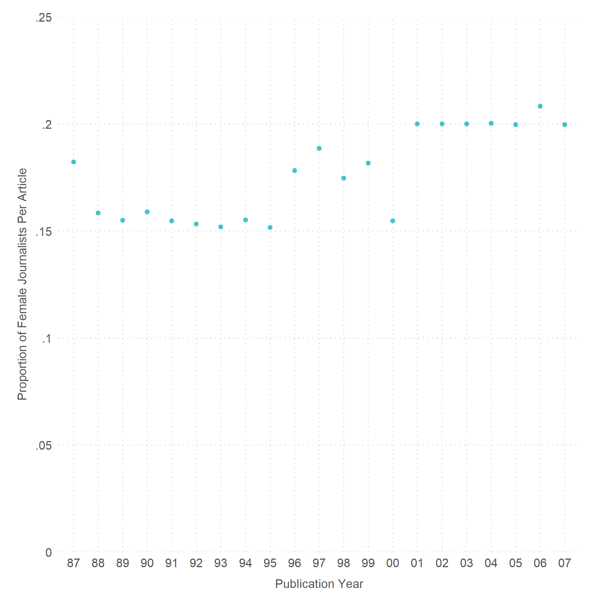

# Good NYT

The New York Times (NYT) is nation's newspaper of record. It is well-regarded and it is popular. It has won more Pulitzer awards than any other newspaper. And it is the [30th most visited website in the U.S.](https://www.alexa.com/siteinfo/nytimes.com) (as of October, 2017).

We explore a few patterns in the NYT using the the annotated [New York Times Corpus](https://catalog.ldc.upenn.edu/ldc2008t19).

### Data Analysis

0. [Convert NYT Corpus to CSV](https://github.com/soodoku/nytimes-corpus-extractor), and [Recode](scripts/01_nyt_recode.R)  

1. **Not News**  
   Has the proportion of news stories about topics unrelated to politics or the economy, such as, cooking, travel, fashion, music, etc.,  gone up over time? 

   We measure kinds of news stories using *news.desk* and *online.section*. (See the script for other ideas for how we can measure the kind of news.)  

     - Proportion of Apolitical News Over Time: [Script](scripts/01_apolitical_news.R) and [Figure: Entire Newspaper (Using News Desk)](figs/all_apol_nd_by_month.pdf), [Figure: Section A1 (Using News Desk)](figs/a1_apol_nd_by_month.pdf), and [Figure: Entire Newspaper (Using News Desk and Online Section)](figs/all_apol_3_by_month.pdf)  

2. **Urban Vs. Rural**  
    We use the *locations* (hand indexed), *online.locations* (algorithmically generated), and *dateline* fields to estimate rural vs. urban coverage within the US.  
      - Script and Figure

3. **National Vs. International**
    We use the *news.desk* field *Foreign News* to estimate coverage of foreign news. We can also use the *locations* (hand indexed), *online.locations* (algorithmically generated), and *dateline* fields to estimate national vs. international coverage.  
      - Proportion of Foreign Desk Stories Over Time: [Script](scripts/03_national.R) and [Figure](figs/all_int_by_month.pdf).

        

4. **Corrections**  
    We use the *correction.date* and *correction.text* to estimate rate of corrections over time, and what is being corrected (later).
      - Proportion of Corrections Per Year: [Script](scripts/04_correction.R) and [Figure](figs/all_cor_by_yr.pdf).

5. **Length of Articles**  
    We use the *word.count* field to estimate average length of articles and how it has changed over time.  
      - Article Word Count Over Time: [Script](scripts/05_word_count.R), [Figure: Average Word Count](figs/all_word_lenby_mon.pdf), and [Figure: Median Word Count](figs/all_word_len_median_by_mon.pdf).

        

6. **Number of Authors per Article**  
    We use *normalized.byline* to estimate number of authors per article and how that has changed over time.  
      - Average Number of Authors per Article Over Time: [Script](scripts/06_authors_per_article.R) and [Figure](figs/all_n_auth_by_yr.pdf).

7. **No. of Articles per Author per Year**  
    One common conjecture is that people are producing more. Is that true? We use the *normalized.byline* field to estimate average number of articles per year per author and how that metric has evolved over time.  
      - No. of articles per author per year over time: [Script](scripts/07_n_stories_per_author.R) and Figure.

8. **Proportion of Wire Stories**  
     Using *byline*.  
       - Proportion of AP and Reuters Stories Over Time: [Script](scripts/08_wire_stories.R) and [Figure](figs/all_wire_by_yr.pdf)

9. **Race and Gender of Reporters**  
    We use *normalized.byline* to get the names of the reporters. And we use the [gender package](https://github.com/ropensci/gender) and the [ethnicolr package](https://github.com/appeler/ethnicolr) to impute gender and race of reporters.  
      - Proportion of Female Journalists on Staff Over Time: [Script](scripts/09_women.R) and [Figure](figs/all_avg_fem_by_yr.pdf).  
      - Average Number of Female Journalists per Article Over Time: [Script](scripts/09_women.R) and [Figure](figs/all_avg_fem_per_art_by_yr.pdf).

### Author

Gaurav Sood

### License

Released under [CC BY 2.0](https://creativecommons.org/licenses/by/2.0/). 